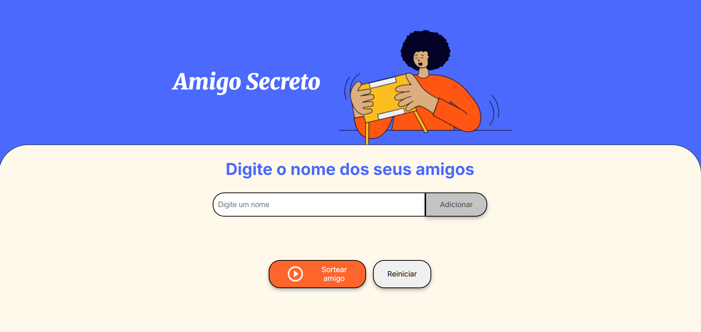

# 🎁 Sorteio de Amigo Secreto

Bem-vindo(a) ao meu projeto de **Sorteio de Amigo Secreto**, uma aplicação web simples e interativa que permite adicionar amigos, listar nomes e sortear aleatoriamente um participante!

Este projeto faz parte do meu plano de estudos no **Programa Oracle Next Education (ONE)** em parceria com a **Alura**, e representa uma etapa importante no meu desenvolvimento pessoal e profissional na área de **Programação Web**.

---

## ✨ Funcionalidades

✅ Adicionar nomes de amigos à lista  
✅ Listar todos os nomes adicionados  
✅ Sortear aleatoriamente um amigo da lista  
✅ Reiniciar a aplicação a qualquer momento  
✅ Layout responsivo e estilizado com CSS

---

## 📸 Demonstração

  
*Interface amigável e colorida para deixar o sorteio mais divertido!*

---

## 🚀 Tecnologias utilizadas

- HTML5
- CSS3
- JavaScript (puro/vanilla)

---

## 🧠 O que eu aprendi

Durante o desenvolvimento deste projeto, aprofundei meus conhecimentos em:

- Manipulação do DOM com JavaScript
- Validação de formulários
- Manipulação de arrays
- Eventos e interação com o usuário
- Organização e estilização de elementos com CSS
- Responsividade e design amigável

---

## 📚 Projeto educacional

Este projeto faz parte do meu processo de formação através do programa:

> **Oracle Next Education (ONE)** – uma iniciativa da Oracle em parceria com a [Alura](https://www.alura.com.br) que visa promover inclusão e formação profissional em tecnologia.

---

## 🔧 Como executar o projeto

1. Clone este repositório:
git clone [https://github.com/lsbonifazio/amigo-secreto-ONE]

2. Acesse a pasta do projeto:
cd amigo-secreto-ONE

3. Abra o arquivo `index.html` no navegador.

---

## 💡 Próximos passos (ideias de melhorias)

- Adicionar animações para o sorteio
- Prevenir que a mesma pessoa se auto-sorteie (modo completo de amigo secreto)
- Compartilhar resultado via WhatsApp ou e-mail
- Armazenar nomes no localStorage para manter a lista

---

## 🤝 Contribuição

Sinta-se à vontade para abrir issues ou pull requests com sugestões de melhoria. Toda ajuda é bem-vinda!

---

## 🙋‍♀️ Sobre mim

Me chamo **Letícia Schulz Bonifazio** e estou em transição de carreira para a área de tecnologia. Acredito no poder da educação e na capacidade de construir soluções que aproximem pessoas — e um sorteio de amigo secreto é um ótimo exemplo disso!

📫 Me encontre no [LinkedIn](https://www.linkedin.com/in/lsbonifazio)

---

## 📄 Licença

Este projeto está sob a licença MIT. Veja o arquivo [LICENSE](LICENSE) para mais detalhes.
